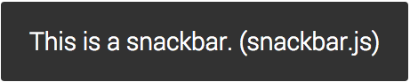

# snackbar.js
snackbar.js is a jQuery plugin that replicates Google's Material Design snackbar. It gives you full control over how it looks and how it behaves.

## Usage
Include jQuery and jQuery UI in your project.
```html
<link rel="stylesheet" href="https://ajax.googleapis.com/ajax/libs/jqueryui/1.11.4/themes/smoothness/jquery-ui.css">
<script src="https://ajax.googleapis.com/ajax/libs/jquery/2.1.4/jquery.min.js"></script>
<script src="https://ajax.googleapis.com/ajax/libs/jqueryui/1.11.4/jquery-ui.min.js"></script>
```
Also include `snackbar.js` in your project.
```html
<script src="snackbar.js"></script>
```
To apply the snackbar to an element, use:
```javascript
$("#element").snackbar();
```

## Example
```javascript
$("body").snackbar();
```
results in



## Options
These are the defaults but can be changed to anything you want
```javascript
primaryCol = "#FFFFFF",
accentCol = "#EFFC0A",
duration = 3,
message = "This is a snackbar. (snackbar.js)",
option = false,
optionText = "",
swipe = false
callback = function(){}
```

### Details
`primaryCol`: Primary text color

`accentCol`: Option text color

`duration`: In seconds

`message`: Snackbar content

`option`: Have option (true or false)

`optionText`: Text for option (option must be true for this to show)

`swipe`: Swipe to dismiss (does not dismiss in specified duration if true)

`callback`: Function to call on option click
